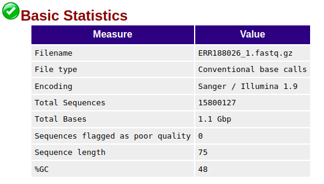
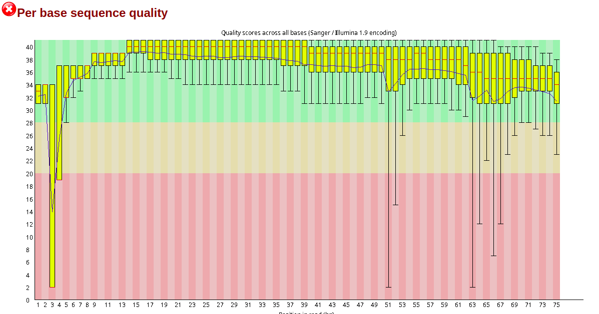
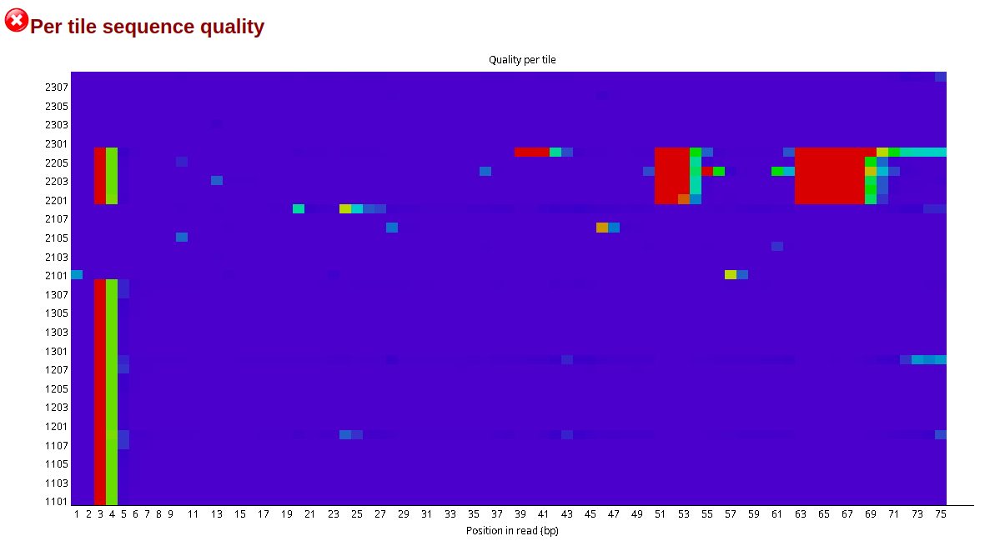
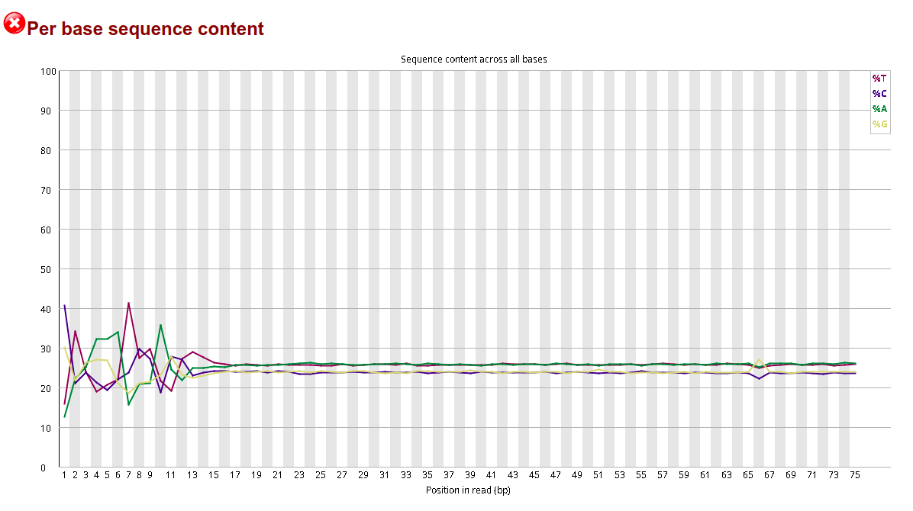
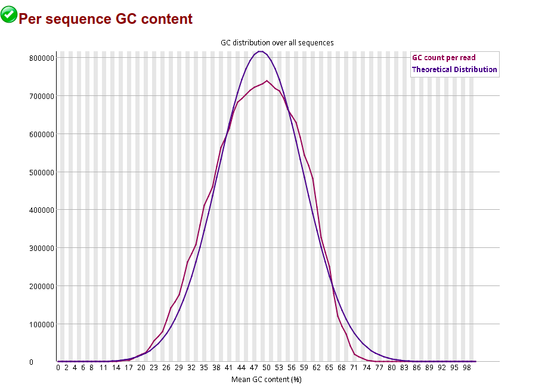
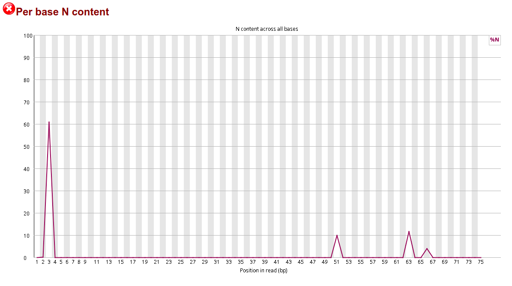
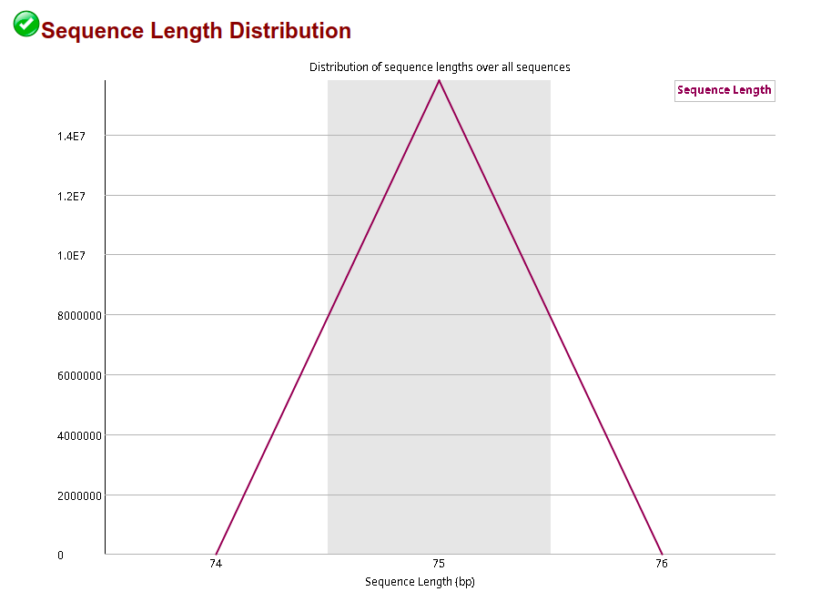
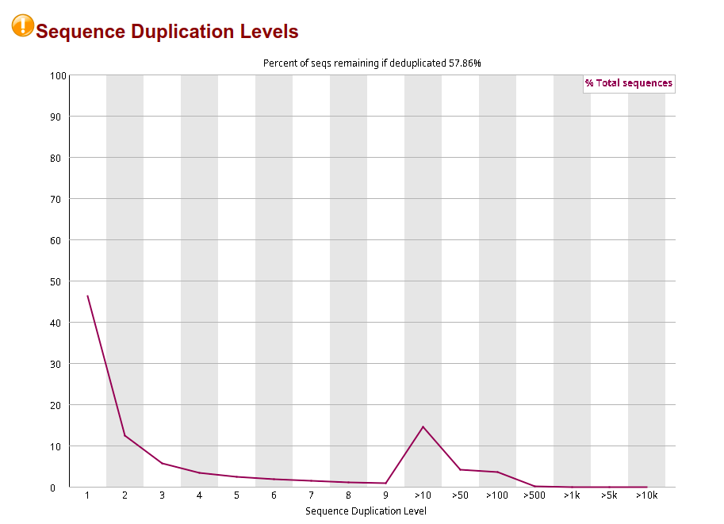

#  quality control (QC) metrics
## Yield
Yield is the number of bases generated in the run. Yield is important to all users, but is usually something your service provider will guarantee so you don't need to worry about it.
Error rate
Refers to the percentage of bases called incorrectly at any one cycle. It is calculated from the reads that are aligned to Illumina's PhiX control. If this was not used then %>=Q30 is your best tool to check base quality. Error rate increases along the length of the read.
## %Q30
The percentage of bases with a quality score of 30 or higher, respectively (see "Quality Scores Explained" below). Most Illumina runs will generate >70-80% Q30 data. This value is an average across the whole read length, and error rate increases towards the end of the reads. Because of this a run can "fail" at the end of a long-read, but pass Illumina's specs for the run with respect to Q30 - if a read is Q40 for bases 1-100, and Q10 for bases 101-150 it will pass the Q30 spec, but if you need the ends of the reads to be high quality, you may be disappointed.
## Density (K/mm2)
The density of clusters on the flow cell (in thousands per mm2). On MiniSeq, MiSeq, NextSeq and HiSeq 2500 this is an important metric to evaluate if the data are low-quality. It should be assessed in tandem with %PF as the two together can diagnose problems with over- or under-loading your library. On HiSeq 4000 and X density is a fixed value and diagnosing issues with library loading are much more difficult to fix.
## Cluster PF (%)
In Illumina clustering a single-molecule should generate a single cluster with a clear signal in the base being sequenced. The %PF is the number of clusters that passed Illumina's "Chastity filter". The clusters that do not pass this filter are generally removed from downstream analysis.

The Chastity filter works by calculating the ratio of the highest base intensity to the sum of the 1st and 2nd highest, anything less than 0.6 is filtered out. If a cluster was formed from a single-molecule then the chastity score will be 1; if it were formed from two molecules the signal would be equal and the chastity score will be 0.5.
## Phas/Prephas (%)
This is an important metric to pay attention to - low numbers are what you want to see e.g. 0.1/0.1. Phasing is the rate at which individual molecules in a cluster become out of sync with each other, with some falling behind (phasing), and others jumping ahead (pre-phasing). The value given is the percentage of true signal being lost in each cycle, so after 150 cycles 15% of the data is now noise. Phasing is why long-reads are difficult!

>>> ## Download data sets

We will download 4 fastq files of 1000 genomes data sets using the link below:
>https://www.ebi.ac.uk/ena/browser/view/PRJEB3366

>https://www.ebi.ac.uk/biostudies/arrayexpress/studies/E-GEUV-1

>https://github.com/nellore/rail/blob/master/eval/E-GEUV-3.sdrf.txt


>> commandline to download 
```bash
wget -nc ftp://ftp.sra.ebi.ac.uk/vol1/fastq/ERR188/ERR188027/ERR188027_1.fastq.gz
wget -nc ftp://ftp.sra.ebi.ac.uk/vol1/fastq/ERR188/ERR188026/ERR188026_2.fastq.gz
wget -nc ftp://ftp.sra.ebi.ac.uk/vol1/fastq/ERR188/ERR188030/ERR188030_1.fastq.gz
wget -nc ftp://ftp.sra.ebi.ac.uk/vol1/fastq/ERR188/ERR188030/ERR188030_2.fastq.gz
wget -nc ftp://ftp.sra.ebi.ac.uk/vol1/fastq/ERR188/ERR188026/ERR188026_1.fastq.gz
wget -nc ftp://ftp.sra.ebi.ac.uk/vol1/fastq/ERR188/ERR188027/ERR188027_2.fastq.gz
```

>>> ## Tools for quality control assessment 
1. fastqc https://www.bioinformatics.babraham.ac.uk/projects/fastqc/
2. multiqc  https://multiqc.info/
3. picard https://broadinstitute.github.io/picard/

>>> ## checking quality control of fastq files. 
```bash
#---->  fastqc 1.fastq.gz  2.fastq.gz 
fastqc ERR188026_1.fastq.gz  ERR188026_2.fastq.gz 
fastqc ERR188027_1.fastq.gz  ERR188027_2.fastq.gz
fastqc ERR188030_1.fastq.gz  ERR188030_2.fastq.gz
```
>>> ## fastqc report 
1. Summary
1. Basic Statistics
2. Per base sequence quality
3. Per tile sequence quality
4 Per sequence quality scores
5. Per base sequence content
6. Per sequence GC content
7. Per base N content
8. Sequence Length Distribution
9. Sequence Duplication Levels
10. Overrepresented sequences
12. Adapter Content

>>> ## quality assessment status  
PASS: 

FAIL: 

WARNING:

## fastqc report: Basic statistics 
1. Filename:  The original filename of the file which was analysed	
2. File type:  Whether the file appeared to contain actual base calls or colorspace data which had to be converted to base calls	 
3. Encoding: ASCII encoding of quality values 	 
4. Total Sequences:  A count of the total number of sequences processed.  In future will be two values : actual and estimated	 
5. Total Bases	 
6. Sequences flagged as poor quality: If running in Casava mode sequences flagged to be filtered will be removed from all analyses 
7. Sequence length: Provides the length of the shortest and longest sequence in the set. If all sequences are the same length only one value is reported.	 
7. %GC: he overall %GC of all bases in all sequences	 

 

> Warning
Basic Statistics never raises a warning.


> Failure
Basic Statistics never raises an error.

## fastqc report: Per base sequence quality
1. A	box-and-whisker	plot	showing	aggregated	quality	score	
statistics	at	each	position	along	all	reads	in	the	file.	
2. Note	that	the	X-axis	is	not	uniform.
3. the	X-axis	 starts	out	with	bases	1-10	being	reported	individually,	after	that, it	will	bin	bases	across	a
window	a	certain	number	of	positions	wide.	
4. The	number	of	base	positions	binned	 together	depends	on	the	length	of	the	reads, i.e, 	Shorter	reads	will	have	
smaller	windows	and	longer	reads	larger	windows. 
4. The	blue	line	is	the	mean	quality	score	at	each	base	position/window.
5. The	red	line	within	each	yellow	box	represents	the	median	quality	score	at	that	position/window.
6. Yellow	box	is	the	inner-quartile	range	for	25th to	75th percentile.
7. The	upper	and	lower	whiskers	represent	the	10th and	90th percentile	scores.
8. The y-axis on the graph shows the quality scores. The higher the score the better the
base call. 
9. The background of the graph divides the y axis into very good quality calls
(green), calls of reasonable quality (orange), and calls of poor quality (red). 

> `#40E0D0 Note that The quality of calls on most platforms will degrade as the run progresses, so it is common to see base`
calls falling into the orange area towards the end of a read.

> `#40E0D Note that FastQC attempts to automatically determine which encoding method was in any fastq file.`

 

> Warning
A warning will be issued if the lower quartile for any base is less than 10, or if the median
for any base is less than 25.

> Failure
This module will raise a failure if the lower quartile for any base is less than 5 or if the
median for any base is less than 20.


## Per tile sequence quality
1. This graph will only appear in your analysis results if using an Illumina library which retains its original sequence identifiers. 
2. Encoded in these is the flowcell tile from which each read came. 
3. The graph allows you to look at the quality scores from each tile across all of your bases to see if there was a loss in quality associated with only one part of the flowcell.
4. It is a heatmap  and  colours are on a cold to hot scale.
5. The  cold colours indicate that  quality was at or above the average for that base in the run.
6. The hotter colours indicate that a tile had worse qualities than other tiles for that base.


> `Note that  We would generally ignore errors which mildly affected a small number of tiles for only 1 or 2 cycles, but would pursue larger effects which showed high deviation in scores, or which persisted for several cycles.`

 

> Warning
This module will issue a warning if any tile shows a mean Phred score more than 2 less than the mean for that base across all tiles.

> Failure
This module will issue a warning if any tile shows a mean Phred score more than 5 less than the mean for that base across all tiles.

## Per sequence quality scores
1. It plots the average quality score over the full length of all reads on the x-axis and gives the total number of reads with this score on the y-axis:
2. It is often the case that a subset of sequences will have universally poor quality, because they are poorly imaged (on the edge of the field of view etc)
3. The poor quality sequences should represent only a small percentage of the total sequences.
4. If a significant proportion of the sequences in a run have overall low quality then this could indicate some kind of systematic problem.

> `Note that  this image will not be displayed if  a BAM/SAM file  used an an input.`

>  `Note that If a bi-modal, or complex distribution is seen then the results should be evaluated in concert with the per-tile qualities (if available) since this might indicate the reason for the loss in quality of a subset of sequences.`

> `Errors here usually indicate a general loss of quality within a run`

 

> Warning
A warning is raised if the most frequently observed mean quality is below 27 - this equates to a 0.2% error rate.

> Failure
An error is raised if the most frequently observed mean quality is below 20 - this equates to a 1% error rate.

## Per base sequence content
1. Per Base Sequence Content plots out the proportion of each base position in a file for which each of the four normal DNA bases has been called.
2. In a random library you would expect that there would be little to no difference between the different bases of a sequence run,

> `Note thatsome types of library will always produce biased sequence composition, normally at the start of the read.`

> `Note that Overrepresented sequences  such as adapter dimers or rRNA in a sample then these sequences may bias the overall composition and their sequence will emerge from this plot.`

> `Biased fragmentation:  due to a biased selection of random primers `

> `Biased composition libraries:  library which has been treated with sodium bisulphite which will then have converted most of the cytosines to thymines,`

 


> Warning
This module issues a warning if the difference between A and T, or G and C is greater than 10% in any position.

> Failure
This module will fail if the difference between A and T, or G and C is greater than 20% in any position.
## Per sequence GC content
1. GC content across the whole length of each sequence in a file and compared  to a modelled normal distribution of GC content.
2. In a normal random library you would expect to see a roughly normal distribution of GC content where the central peak corresponds to the overall GC content of the underlying genome.
3. An unusually shaped distribution could indicate a contaminated library or some other kinds of biased subset. 
4. A normal distribution which is shifted indicates some systematic bias which is independent of base position.
5. If there is a systematic bias which creates a shifted normal distribution then this won't be flagged as an error by the module since it doesn't know what your genome's GC content should be.


> `Note that Sharp peaks on an otherwise smooth distribution are normally the result of a specific contaminant (adapter dimers for example), `

 

> Warning
A warning is raised if the sum of the deviations from the normal distribution represents more than 15% of the reads.

> Failure
This module will indicate a failure if the sum of the deviations from the normal distribution represents more than 30% of the reads.


## Per base N content
1. plots out the percentage of base calls at each position for which an N was called.
2. If a sequencer is unable to make a base call with sufficient confidence then it will normally substitute an N rather than a conventional base call

> `Note that It is common to see a very low proportion of Ns appearing in a sequence, especially nearer the end of a sequence. `

> The most common reason for the inclusion of significant proportions of Ns is a general loss of quality,

> Another common scenario is the incidence of a high proportions of N at a small number of positions early in the library, against a background of generally good quality. Such deviations can occur when you have very biased sequence composition in the library to the point that base callers can become confused and make poor calls. This type of problem will be apparent when looking at the per-base sequence content results

 


> Warning
This module raises a warning if any position shows an N content of >5%.

> Failure
This module will raise an error if any position shows an N content of >20%.

## Sequence Length Distribution
1. A graph showing the distribution of fragment sizes in the file which was analysed.

> `Note that For some sequencing platforms it is entirely normal to have different read lengths.`


 

> Warning
This module will raise a warning if all sequences are not the same length.

> Failure
This module will raise an error if any of the sequences have zero length.

## Sequence Duplication Levels
1. Plot degree of duplication for every sequence. 
2. In a diverse library most sequences will occur only once in the final set.
3. To cut down on the memory requirements for this module only sequences which first appear in the first 100,000 sequences in each file are analysed, then each sequence is tracked to the end of the file to give a representative count of the overall duplication level.
3. Any reads over 75bp in length are truncated to 50bp for the purposes of this analysis. 
5. To cut down on the amount of information in the final plot any sequences with more than 10 duplicates are placed into grouped bins to give a clear impression of the overall duplication level without having to show each individual duplication value.
6.  There are two lines on the plot. The blue line takes the full sequence set and shows how its duplication levels are distributed. In the red plot the sequences are de-duplicated and the proportions shown are the proportions of the deduplicated set which come from different duplication levels in the original data.

> `Note: A low level of duplication may indicate a very high level of coverage of the target sequence, but a high level of duplication is more likely to indicate some kind of enrichment bias (eg PCR over amplification).`

 

> Warning
This module will issue a warning if non-unique sequences make up more than 20% of the total.

> Failure
This module will issue a error if non-unique sequences make up more than 50% of the total.
## Overrepresented sequences
1. lists all of the sequence which make up more than 0.1% of the total.
2.  To conserve memory only sequences which appear in the first 100,000 sequences are tracked to the end of the file.
3. Finding that a single sequence is very overrepresented in the set either means that it is highly biologically significant, or indicates that the library is contaminated, or not as diverse as you expected.
4. For each overrepresented sequence the program will look for matches in a database of common contaminants and will report the best hit it finds. Hits must be at least 20bp in length and have no more than 1 mismatch.  Finding a hit doesn't necessarily mean that this is the source of the contamination, but may point you in the right direction. 
5.  It's also worth pointing out that many adapter sequences are very similar to each other so you may get a hit reported which isn't technically correct, but which has very similar sequence to the actual match.


>  To conserve memory only sequences which appear in the first 100,000 sequences are tracked to the end of the file.
>  Because the duplication detection requires an exact sequence match over the whole length of the sequence any reads over 75bp in length are truncated to 50bp for the purposes of this analysis.

> Warning
This module will issue a warning if any sequence is found to represent more than 0.1% of the total.

> Failure
This module will issue an error if any sequence is found to represent more than 1% of the total.

## Adapter Content


## Kmer Content


# References
1. Matlock, B. & Scientific, T. F. Assessment of nucleic acid purity. https://assets.thermofisher.com/TFS-Assets/CAD/Product-Bulletins/TN52646-E-0215M-NucleicAcid.pdf. 

2. Mueller, O., Lightfoot, S. & Schroeder, A. RNA integrity number (RIN) -standardization of RNA quality control. https://www.agilent.com/cs/library/applications/5989-1165EN.pdf (2006). 

3. Illumina Inc. Optimizing cluster density on illumina sequencing systems. https://www.illumina.com/content/dam/illumina-marketing/documents/products/other/miseq-overclustering-primer-770-2014-038.pdf (2016). 

4. Hosseini M, Pratas D and Pinho AJ (2016) A Survey on Data Compression Methods for Biological Sequences. Information. An International Interdisciplinary Journal 7(4). Multidisciplinary Digital Publishing Institute: 56.

5. Andrews S (n.d.) Babraham Bioinformatics – FastQC A Quality Control tool for High Throughput Sequence Data. Available at: https://www.bioinformatics.babraham.ac.uk/projects/fastqc/ (accessed 13 October 2023).